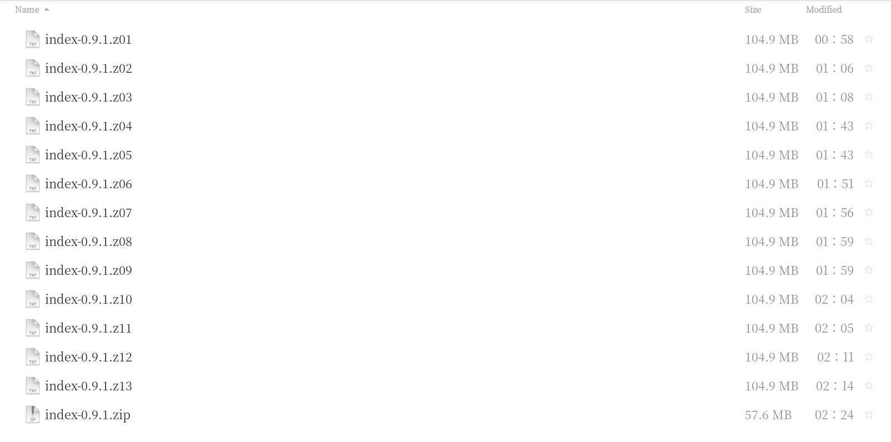
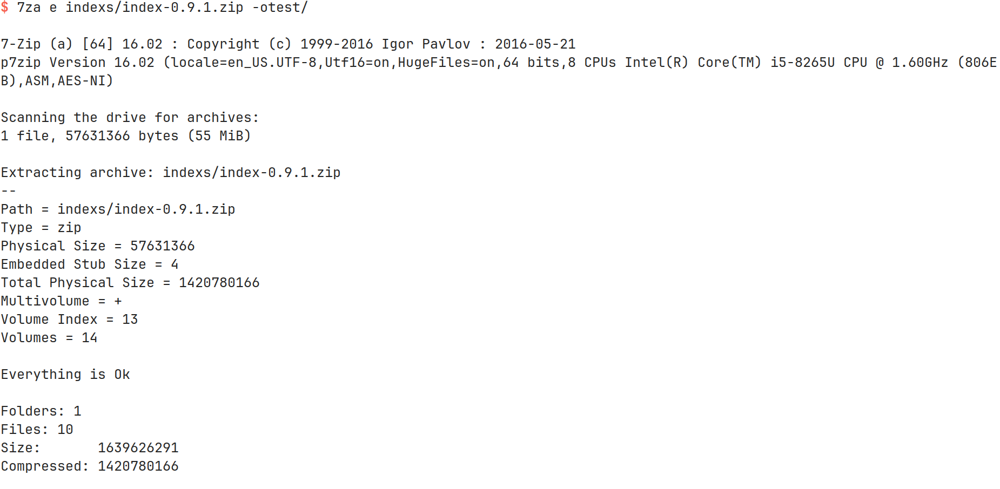
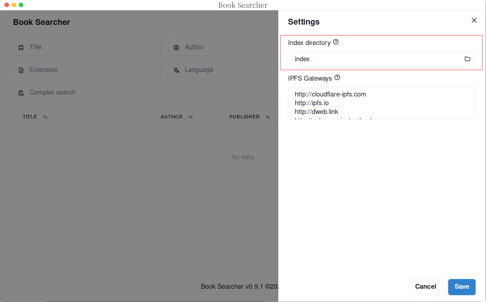
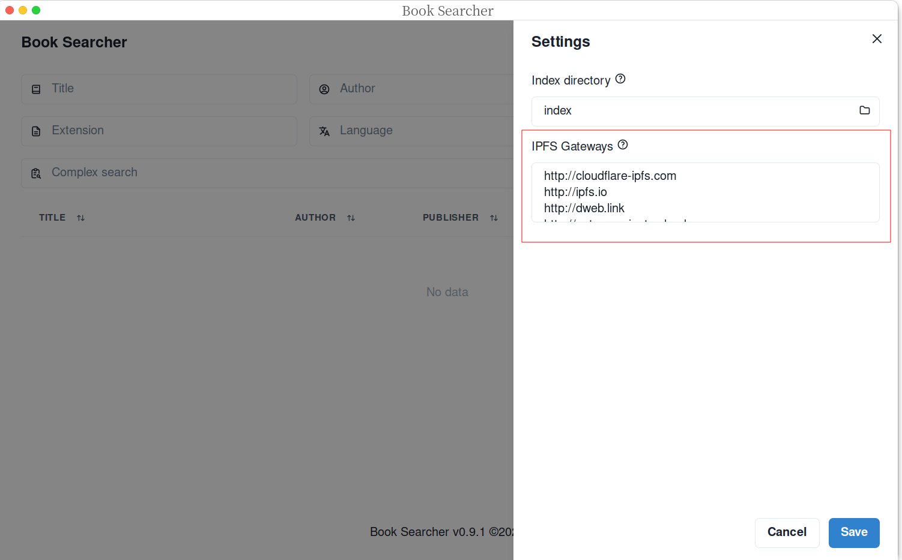
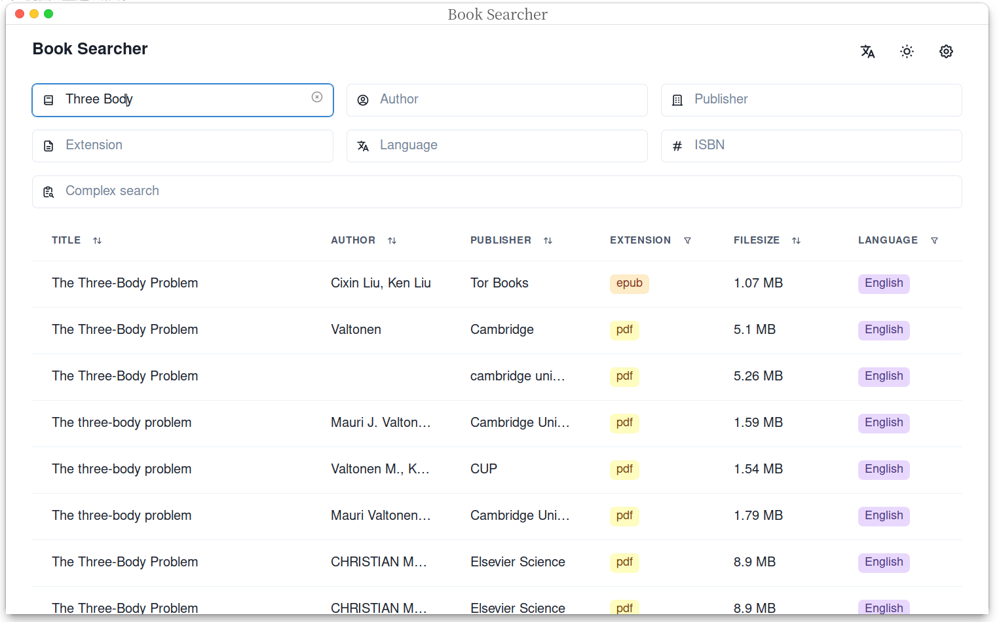

### Book Searcher Install

Tutorial on how to install Book Searcher on Ubuntu 23.04 platform (Install book-searcher on the Ubuntu 23.04 platform)

---

1. Go to the [Book-searcher open source project Release page](https://github.com/book-searcher-org/book-searcher/releases) and download the installation package with the suffix `amd64.deb`

   **Note: Please remember the download path of the installation package, it will be used later**

   > If you don't have wget tool installed, you can use `sudo apt install wget` command to install it

   ```shell
   # You can run the following command in the terminal to download the installation package
   wget https://github.com/book-searcher-org/book-searcher/releases/download/0.9.1/Book-Searcher-desktop_0.9.1_amd64.deb
   ```


2. Install Book-searcher installation package

   ```shell
   sudo dpkg -i Book_searcher installation package path
   ```


3. Download `Zlibrary book index file`, corresponding project link: https://github.com/zlib-searcher-new/index

   **Note: All index block files must be in the same folder directory, otherwise they may fail to decompress**

   ```shell
   # You can use wget,curl,axel tools
   # Here I will use axel to demonstrate how to download index files
   # Since the index file is split and compressed into 14 files by the author, we need to download all the index block compressed packages
   axel -n 20 https://github.com/zlib-searcher-new/index/releases/download/0.9.1/index-0.9.1.z01
   axel -n 20 https://github.com/zlib-searcher-new/index/releases/download/0.9.1/index-0.9.1.z02
   axel -n 20 https://github.com/zlib-searcher-new/index/releases/download/0.9.1/index-0.9.1.z03
   axel -n 20 https://github.com/zlib-searcher-new/index/releases/download/0.9.1/index-0.9.1.z04
   axel -n 20 https://github.com/zlib-searcher-new/index/releases/download/0.9.1/index-0.9.1.z05
   axel -n 20 https://github.com/zlib-searcher-new/index/releases/download/0.9.1/index-0.9.1.z06
   axel -n 20 https://github.com/zlib-searcher-new/index/releases/download/0.9.1/index-0.9.1.z07
   axel -n 20 https://github.com/zlib-searcher-new/index/releases/download/0.9.1/index-0.9.1.z08
   axel -n 20 https://github.com/zlib-searcher-new/index/releases/download/0.9.1/index-0.9.1.z09
   axel -n 20 https://github.com/zlib-searcher-new/index/releases/download/0.9.1/index-0.9.1.z10
   axel -n 20 https://github.com/zlib-searcher-new/index/releases/download/0.9.1/index-0.9.1.z11
   axel -n 20 https://github.com/zlib-searcher-new/index/releases/download/0.9.1/index-0.9.1.z12
   axel -n 20 https://github.com/zlib-searcher-new/index/releases/download/0.9.1/index-0.9.1.z13
   axel -n 20 https://github.com/zlib-searcher-new/index/releases/download/0.9.1/index-0.9.1.zip
   ```
   After downloading, the list is as follows: 
    

   <small>**Note:** The download speed may not be very stable (the download time depends on your personal network environment), anyway I got stuck here for a long time......so you have to be patient \^_\^</small>


4. Create an index directory and unzip the index file

   > You need to use 7zip decompression tool here,if you don't have it installed, you can use `sudo apt install p7zip-full` to install 7zip tool

   ```shell
   # Create an index directory (file storage location is optional)
   mkdir index directory storage path
   cd index directory storage path
   
   # Unzip the index file
   #-o and export path are connected!
   7za e index-0.9 .zip -oindex directory storage path
   ```
   Run the Unzip command after, you will see the outputs as follows:
   

   

5. Run Book-searcher, configure index and IPFS gateway

      > If Book-searcher is installed successfully, you can find it on your desktop.
      > You can also use `book-searcher &` command to run it

      - Configure index, select the index directory you just created
        

      - Configure IPFS gateway, IPFS gateway is used to generate download links.Please copy and paste the following links to the Book Searcher software gateway configuration
        ```bash
        http://cloudflare-ipfs.com  
        http://ipfs.io  
        http://dweb.link  
        http://gateway.pinata.cloud  
        https://ipfs.best-practice.se
        ```
        


6. After completing the above configuration, restart the software and test whether the configuration takes effect

    
